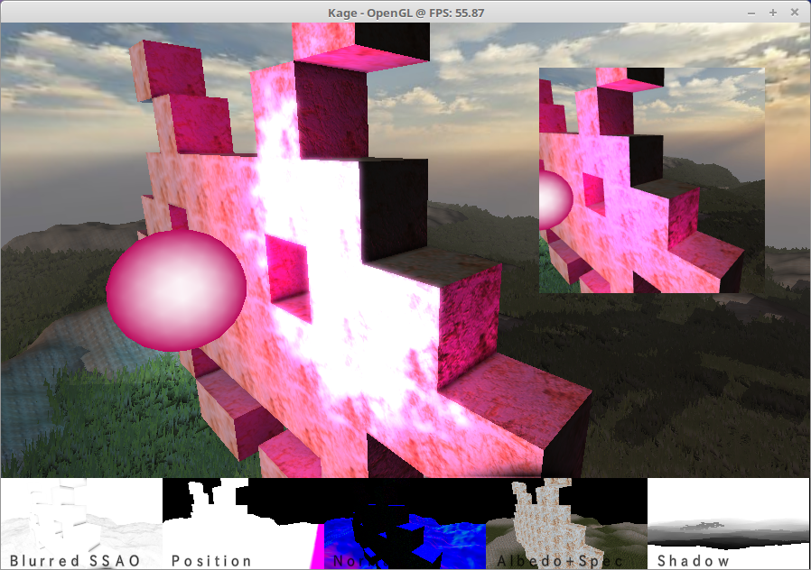

kage / かげ
==========

A personal sandbox for playing with Haskell, (post) modern OpenGL (4.3 Core Profile actually) and, quite marginally, Japanese ("kage" means "shadow").

Even if I usually take care of committing the project in a working state, this project is hardly a source of authority regarding the aforementioned themes. It could change in a (far) future, but, at this time, I'm afraid it's mostly junk code. That being said, the Haskell OpenGL bindings is severely lacking any documentation at all. It's not a problem for the low-level raw binding (OpenGLRaw), which is essentially a one-to-one translation of the C API, but it sometime frustrating for the more Haskellish binding (OpenGL) based on it. Having an existing code example which works is always helpful in this case, just to pick the right function name and way of passing some parameter (texture, buffer...). Beyond that, don't look to closely at the code, both from a Haskell and OpenGL perspective.



Inspiration
-----------

Regarding the OpenGL part, I generally get inspiration from the two sites:

-   [MBSoftWorks](http://www.mbsoftworks.sk/index.php?page=tutorials&series=1)
-   [LearnOpenGL](https://learnopengl.com)

I don't know if they are the best sources (they are better than the OpenGL SuperBible at least),
but since some shader parts and resources actually come from these places,
better give to Caesar what is Caesar's.

Hardware
--------

My code works at home, that is on a linux distro and a AMD RX 470 (free AMDGPU driver).

```
Renderer: Gallium 0.4 on AMD POLARIS10 (DRM 3.3.0 / 4.8.0-41-generic, LLVM 4.0.0)
OpenGL version: 4.5 (Core Profile) Mesa 17.1.2
Shading language version: 4.50
```
